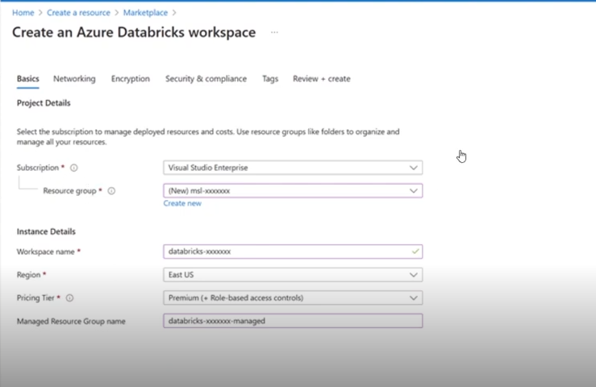
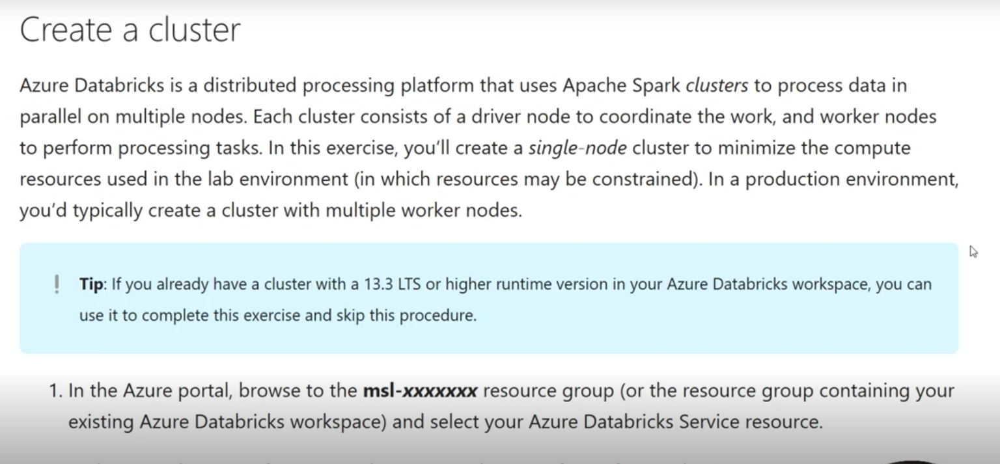
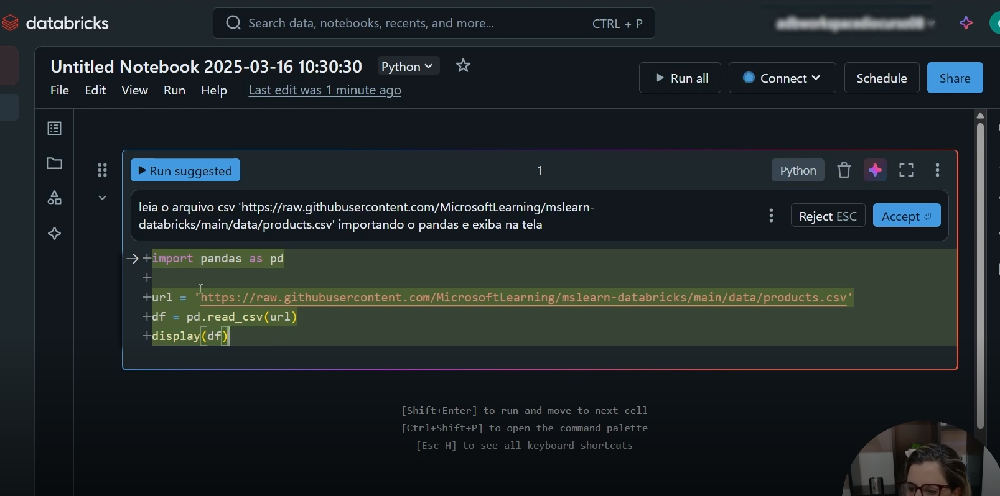

# Introdução ao Azure Databricks

O **Azure Databricks** é uma plataforma de análise de dados baseada em Apache Spark, otimizada para a nuvem Azure. Ele combina a performance de alto nível do Spark com a facilidade de uso de notebooks colaborativos, tornando-se uma ferramenta poderosa para ciência de dados, engenharia de dados e análise de big data.

Com o Azure Databricks é possível processar grandes volumes de dados de forma distribuída, criar pipelines de dados, treinar modelos de machine learning e visualizar insights em tempo real.

---

## 📌 Provisionando um Databricks

**Descrição:**  
Esta tela mostra o processo de criação de um workspace do Databricks no portal do Azure. Nessa etapa, configuramos o nome do recurso, grupo de recursos, região e plano de preço. O workspace é o ambiente central onde clusters e notebooks serão criados e gerenciados.

---

## ⚙️ Criando um Cluster

**Descrição:**  
Após o workspace estar provisionado, o próximo passo é criar um **Cluster**, que é um conjunto de máquinas virtuais configuradas para executar tarefas em Spark. Aqui escolhemos o tipo de instância, o número de workers e configurações adicionais como o tempo de inatividade automático.

---

## 🔍 Usando o Spark para Analisar Dados

**Descrição:**  
Com o cluster em execução, é possível criar notebooks e usar **Apache Spark** para leitura, transformação e análise de dados. O exemplo da imagem mostra o uso de comandos em PySpark para ler arquivos CSV, exibir esquemas e realizar queries sobre os dados. Essa etapa é fundamental para gerar insights a partir de dados brutos no Databricks.

---

## 📂 Estrutura de Pastas Recomendada

